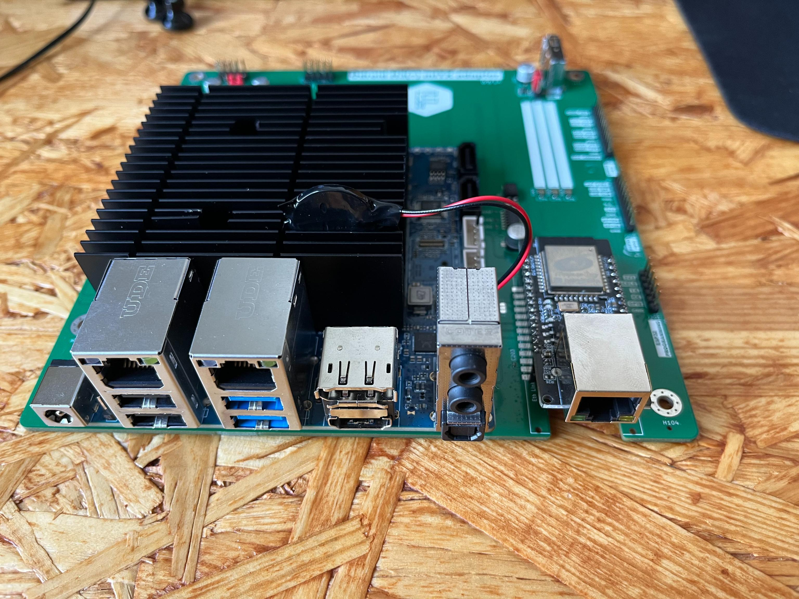
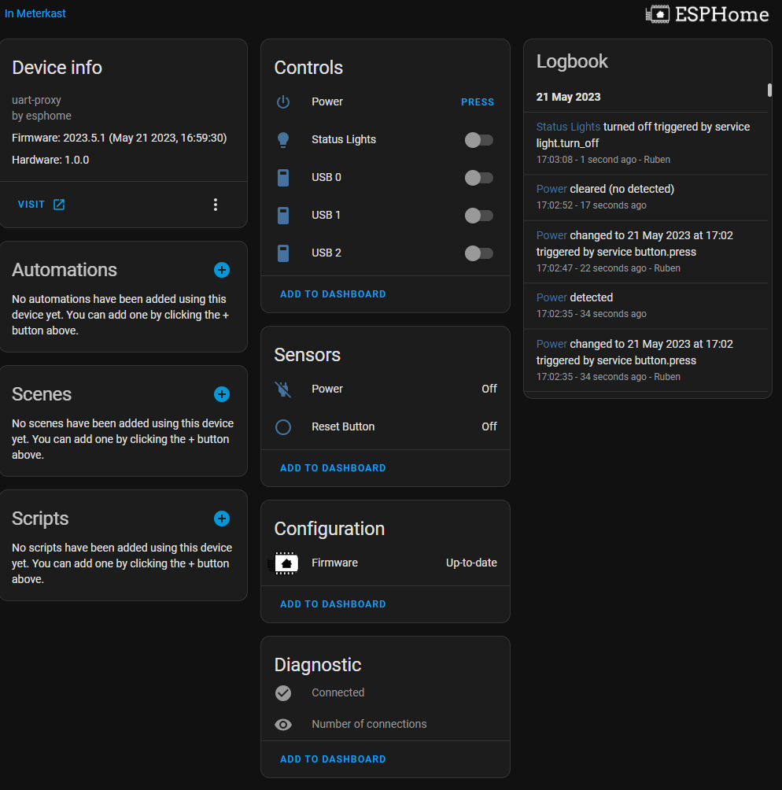

# ESPHome Remote Server Manager

With this ESPHome configuration you will be able to access the BIOS and terminal of the computer connected via UART over a serial TCP stream. At the same time basic things can be controlled and monitored remotely.

## Features

- Raw UART stream over TCP
  - Access via <NODE_NAME>.local:6638
  - Or access via <NODE_IP>:6638

These features are available when used in combination with the hardware of [this project](https://github.com/ruben-iteng/ODROID-H3-mITX-adapter)

  
ODROID-H3-mITX-adapter

  

- Remote UART terminal (e.g. BIOS access)
- 3x USB power control (turn on/off USB power)
- Button input
- 3x APA102 on board RGB LEDs (can be extended via header)
- PC power button control by ESP32 via optocoupler
- Always-on, powered by +5V_STBY
- Connected via Ethernet
- Using the [WT32](https://github.com/ruben-iteng/ESPHome-Remote-Server-Manager/blob/main/documents/WT32-ETH01_datasheet_V1.1-en.pdf) ESP32+Ethernet board

### Home Assistant

## Installation

### Easy mode

You can use the button below to install the pre-built firmware directly to your device via USB from the browser ([WebUSB](https://en.wikipedia.org/wiki/WebUSB) compatibility required).

<esp-web-install-button manifest="./manifest.json"></esp-web-install-button>

### DIY mode

- Install ESPHome from within [Home Assistant](https://esphome.io/guides/getting_started_command_line.html) or using [Docker](https://esphome.io/guides/getting_started_command_line.html)
- Use [this](https://github.com/ruben-iteng/ESPHome-Remote-Server-Manager/blob/main/project-template-esp32.yaml) yaml configuration, compile with ESPHome and flash it to your device
